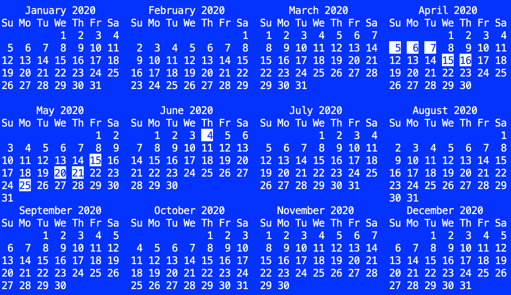

# GitCal
Command line tool that prints a calender that highlights every day that a commit was made to a given project.

## Version
- v1.0 - June 4, 2020
- macOS, Linux, Windows
- [MIT License](LICENSE)
- By Abe Pralle

## Installation
1. Install the [Rogue](https://github.com/AbePralle/Rogue) language.
2. Run `rogo` in this folder to compile **GitCal**.
    - On macOS and Linux a launcher will be created here: `/usr/local/bin/gitcal`.
    - On Windows the build process will print the necessary folder to add to the system PATH environment variable.

## Usage

    gitcal

Run in a folder containing a git project. Example output:

