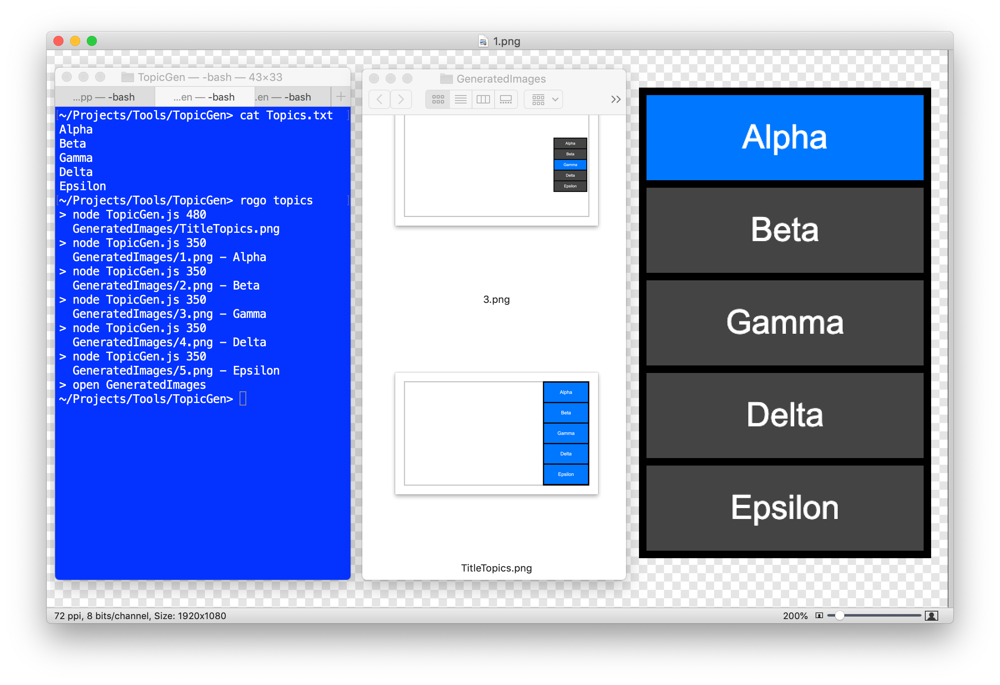

# TopicGen

* Takes a topic list text file and generates series of tabset images, each with a different highlighted topic.
* Uses Node JS + the npm 'puppeteer' library for saving rendered HTML as a PNG image.
* Uses Rogo for driving the overall process.
* Specialized for use in my Anecdotal Abe vlog but the tech can easily be adapted to other custom purposes.
* Built for and only tested on macOS - Linux should work; Windows would need some extra work to link Build.rogue with LibPNG.
* No configuration required - just run 'rogo topics' and it's easy to work out the rest.

