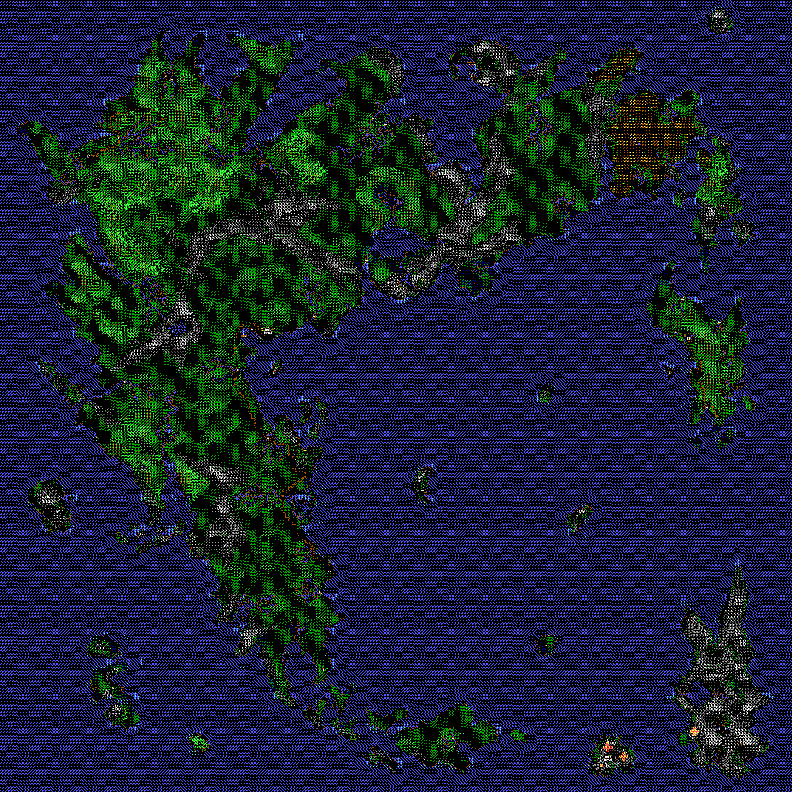

# Ultima V Map Generator

## Compiling (macOS/Linux)
1. Install [Rogue](https://github.com/AbePralle/Rogue).
2. Run `rogo` in this folder.
3. A 4096x4096 map image "U5Map.png" will be generated.

## Output

